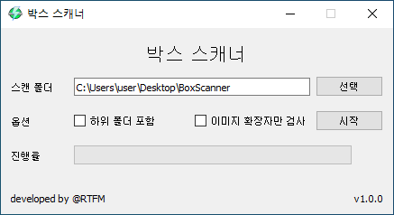

# Box Scanner

## 사용법

### GUI 버전 사용법

1. 스캔할 폴더를 선택하고 옵션을 설정해주세요.
2. 시작 버튼을 누르면 폴더 내 모든 파일에서 박스를 스캔합니다.
3. 폴더 스캔 중 스캔을 중단하고 싶다면 중지 버튼을 눌러주세요.
4. 스캔이 완료되면 result_{현재시각}.csv 파일에 결과가 저장됩니다.
* csv 파일은 메모장이나 엑셀로 열어볼 수 있습니다.

### CLI 버전 사용법
```
box_scanner_cli --scan_dir="스캔 폴더"

box_scanner_cli --scan_dir="스캔 폴더" --sub_dir=True --only_img=True
```

### 출력 결과 설명
결과로 출력되는 식별 라벨의 종류와 각각의 설명은 다음과 같습니다.  
- certain: 확실히 압축 파일이 숨겨져 있는 박스
- suspect: 다른 숨겨진 데이터가 있는 이미지 파일
- not: 숨겨진 데이터가 없는 일반적인 이미지 파일
- unknown: 위 케이스에 속하지 않는 파일
- dir: 탐색 과정에서 발견된 폴더

## 주의사항
본 프로그램으로 모든 케이스의 박스를 식별할 수 있는 것은 아닙니다.  
어디까지나 가능성이 높은 파일을 1차적으로 선별해주는 것으로 너무 맹신하진 마시기 바랍니다.  

## 개발환경
- Windows
- Anaconda 4.10.1
- Python 3.8.8
- Python Library
	- PyQt5

자세한 실행 파일 패키징 과정은 [**packaging_command.md**](packaging_command.md) 참조
